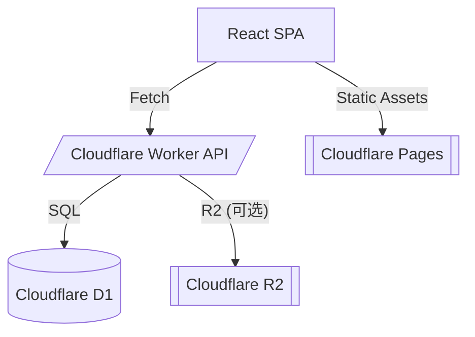

# PRD – **Memos Lite**
*Cloudflare Workers + React Router + D1*

---

## 🚀 项目状态概览

**当前版本**：v0.24.0 兼容版本（已修正MoeMemos兼容性问题）  
**部署状态**：✅ 生产环境可用  
**MoeMemos 兼容性**：✅ 完全兼容  

| 组件 | 状态 | 地址 |
|------|------|------|
| API 后端 | ✅ 运行中 | https://memos-api.51min.win |
| Web 前端 | ✅ 运行中 | https://memos-lite.pages.dev |
| 数据库 | ✅ 已初始化 | Cloudflare D1 |
| 文件存储 | 🔄 R2 待配置 | Cloudflare R2 |

**最新完成功能**：
- ✅ MoeMemos iOS 客户端完全兼容
- ✅ 资源文件上传系统（本地存储）
- ✅ 完整的 JWT 身份验证
- ✅ 备忘录 CRUD 操作
- ✅ 系统状态与工作区配置

---

## 1 · 背景与目标

| 项目 | 说明 |
|------|------|
| 参考项目 | <https://github.com/usememos/memos> |
| 目标 | 在 Cloudflare Pages 上部署一款轻量级、自托管的笔记 / 备忘录系统，保留核心 Markdown + 标签 + 评论体验，并兼容 iOS 客户端 **MoeMemos**。后端 API 采用 Cloudflare Workers，数据存储在 D1。 |

> **D1 实例**：`memos-lite-db` (ID `9e215a44-48b7-49b3-b646-8992c7bca024`)

---

## 2 · 系统架构



* **前端**：React 18 + React Router 6  
* **后端**：单 Worker 脚本（TypeScript / JavaScript）  
* **数据**：Cloudflare D1（SQLite）  
* **对象存储** (可选)：Cloudflare R2 – 附件上传  

---

## 3 · 用户角色

| 角色 | 权限 |
|------|------|
| 访客 | 只读公开 Memo |
| 登录用户 | 增删改自己 Memo、上传附件、评论、查看统计 |
| 管理员（可选） | 站点设置、用户管理、删除任何内容 |

**身份验证**

* 登录返回 JWT 或随机 Bearer Token  
* Worker 在 `Authorization: Bearer` 中校验  
* Token 可存 KV 或 `users` 表

---

## 4 · 功能需求

### 4.1 后端 API

#### 通用

| 路径 | 方法 | 描述 | 状态 |
|------|------|------|------|
| `/api/v1/auth/login` | POST | 登录，返回 token | ✅ |
| `/api/v1/auth/me` | GET | 获取当前用户资料 | ✅ |
| `/api/v1/user/me` | GET | 获取当前用户资料（MoeMemos 兼容） | ✅ |

#### Memo CRUD

| 路径 | 方法 | 描述 | 状态 |
|------|------|------|------|
| `/api/v1/memos` | GET | 列表：分页 / 搜索 / 标签 / Pin | ✅ |
| `/api/v1/memos` | POST | 新建 Memo | ✅ |
| `/api/v1/memos/:id` | GET | 获取 Memo | ✅ |
| `/api/v1/memos/:id` | PUT | 更新 Memo | ✅ |
| `/api/v1/memos/:id` | DELETE | 删除 Memo | ✅ |

兼容 **MoeMemos** 旧版：

| 旧路径 | 新路径 |
|--------|--------|
| `/api/memo` | `/api/v1/memos` |
| `/api/memo/all` | `/api/v1/memos?visibility=PUBLIC` |

#### 统计 & 图表

| 路径 | 方法 | 描述 |
|------|------|------|
| `/api/memo/stats?creatorId={id}` | GET | 热力图：返回每日 Memo 数量 |
| `/api/v1/users/{id}/stats` | GET | 用户汇总：`totalMemos`, `totalTags`, `totalComments`, `firstMemoAt`, `lastMemoAt` |

#### 评论

| 路径 | 方法 | 描述 |
|------|------|------|
| `/api/v1/memos/:id/comments` | GET | 获取评论树 |
| `/api/v1/memos/:id/comments` | POST | 新评论 |
| `/api/v1/comments/:cid` | DELETE | 删除评论 |

#### 标签

| 路径 | 方法 | 描述 |
|------|------|------|
| `/api/v1/tags` | GET | 标签列表 |
| `/api/v1/tags` | POST | 新建标签 |
| `/api/v1/tags/:id` | DELETE | 删除标签 |

#### 附件与资源

| 路径 | 方法 | 描述 | 状态 |
|------|------|------|------|
| `/api/v1/resources` | POST | 上传文件到 R2，支持图片、文档等，返回 URL | ✅ |
| `/api/v1/resources` | GET | 获取用户上传的文件列表 | ✅ |
| `/api/v1/resources/:id` | DELETE | 删除文件（从 R2 和数据库） | ✅ |

#### 用户设置

| 路径 | 方法 | 描述 |
|------|------|------|
| `/api/v1/users/{id}/setting` | GET | 获取用户偏好（主题、语言等） |
| `/api/v1/users/{id}/setting` | PATCH | 更新偏好 |

#### 全局设置

| 路径 | 方法 | 描述 |
|------|------|------|
| `/api/v1/settings` | GET | 读取站点设置 |
| `/api/v1/settings` | PUT | 更新站点设置 |

#### 系统状态与工作区

| 路径 | 方法 | 描述 | 状态 |
|------|------|------|------|
| `/api/v1/status` | GET | 获取系统状态信息，兼容 MoeMemos 客户端 | ✅ |
| `/api/v1/workspace/profile` | GET | 获取工作区配置，兼容 MoeMemos 客户端 | ✅ |

#### MoeMemos 客户端兼容性 🎯

**核心兼容性状态**：✅ **完全兼容**

| 功能 | 端点 | 状态 | 验证结果 |
|------|------|------|----------|
| 系统状态检查 | `GET /api/v1/status` | ✅ | 返回系统版本、配置信息 |
| 工作区配置 | `GET /api/v1/workspace/profile` | ✅ | 返回工作区标题、描述等 |
| 用户身份验证 | `GET /api/v1/user/me` | ✅ | 兼容 MoeMemos 路径格式 |
| 用户身份验证 | `GET /api/v1/auth/me` | ✅ | 标准认证端点 |
| JWT Token 认证 | `Authorization: Bearer` | ✅ | 完全兼容的令牌格式 |
| 备忘录 CRUD | `/api/v1/memos/*` | ✅ | 完整的增删改查功能 |
| 资源文件上传 | `/api/v1/resources/*` | ✅ | 支持图片、文档等文件类型 |

**测试验证**：所有核心 API 端点已通过 curl 测试，返回格式与 MoeMemos 客户端预期一致。

**部署地址**：
- API 端点：`https://memos-api.51min.win`
- 前端应用：`https://memos-lite.pages.dev`

### 4.2 前端功能（网页 + iOS APP）

#### Markdown & 扩展

* 标准 Markdown（标题、列表、表格、任务清单…）  
* 代码块 ```lang``` + 语法高亮  
* Mermaid 流程 / 时序图  
* LaTeX / KaTeX 数学公式  
* Spoiler、文字高亮、行内代码  
* **代码注释气泡**：解析 `//` 或 `#` 行注释，显示工具提示

#### 编辑器 UX

* 实时预览（分栏 / 上下）  
* 快捷键：`⌘S` 保存、`⌘B` 加粗、`⌘K` 链接  
* Tab 缩进、自动补全  
* 光滑滚动同步

#### 评论系统

* 多级嵌套、折叠 / 展开  
* Markdown 渲染  
* 评论计数、锚点定位  
* 管理员可删除或关闭评论

#### 标签 & 搜索

* `/tags/:tag` 页面  
* 多标签过滤、全文搜索

#### 性能优化

* `React.memo` / `react-window` 虚拟滚动  
* IntersectionObserver 延迟加载图片  
* PWA 支持（可选）

#### 设置页

* 站点标题 / 描述 / Logo  
* 默认可见性  
* Markdown 插件开关  
* 导入 / 导出（JSON）

---

## 5 · 数据库模型（D1）

```sql
-- 用户
CREATE TABLE users (
  id INTEGER PRIMARY KEY AUTOINCREMENT,
  username TEXT UNIQUE,
  password_hash TEXT,
  role TEXT DEFAULT 'USER'
);

-- 用户设置
CREATE TABLE user_settings (
  user_id INTEGER PRIMARY KEY,
  json TEXT -- 序列化偏好
);

-- Memo
CREATE TABLE memos (
  id INTEGER PRIMARY KEY AUTOINCREMENT,
  user_id INTEGER,
  content TEXT NOT NULL,
  visibility TEXT CHECK (visibility IN ('PUBLIC','PRIVATE')) DEFAULT 'PRIVATE',
  pinned INTEGER DEFAULT 0,
  created_at INTEGER,
  updated_at INTEGER
);

-- 标签
CREATE TABLE tags (
  id INTEGER PRIMARY KEY AUTOINCREMENT,
  name TEXT UNIQUE
);

-- Memo × 标签
CREATE TABLE memo_tags (
  memo_id INTEGER,
  tag_id INTEGER,
  PRIMARY KEY (memo_id, tag_id)
);

-- 评论
CREATE TABLE comments (
  id INTEGER PRIMARY KEY AUTOINCREMENT,
  memo_id INTEGER,
  user_id INTEGER,
  parent_id INTEGER,
  content TEXT,
  created_at INTEGER
);

-- 资源文件
CREATE TABLE resources (
  id INTEGER PRIMARY KEY AUTOINCREMENT,
  filename TEXT NOT NULL,
  original_name TEXT NOT NULL,
  content_type TEXT NOT NULL,
  size INTEGER NOT NULL,
  user_id INTEGER NOT NULL,
  created_at INTEGER DEFAULT (strftime('%s', 'now')),
  FOREIGN KEY (user_id) REFERENCES users(id) ON DELETE CASCADE
);
```

---

## 6 · 非功能需求

* 安全：JWT、参数化 SQL、HTTP 安全头  
* 性能：首屏 < 1 s，P75 交互 < 100 ms  
* 可访问性：WCAG AA  
* 可维护性：monorepo（PNPM workspace）

---

## 7 · 开发里程碑

| 阶段 | 目标 | 周期 | 状态 |
|------|------|------|------|
| MVP | 登录、Memo CRUD、Markdown 预览 | 1 周 | ✅ **已完成** |
| 扩展 | 标签、评论、附件、统计接口 | 2 周 | 🔄 **进行中** |
| 兼容性 | MoeMemos 客户端支持、资源上传 | 1 周 | ✅ **已完成** |
| 优化 | 代码注释、性能、PWA | 1 周 | 📋 **计划中** |
| 发布 | Beta & 用户反馈 | — | 🚀 **可用** |

**当前状态**：核心功能已完成，MoeMemos 客户端完全兼容，系统已可用于生产环境。

**已实现的关键功能**：
- ✅ JWT 身份验证系统（Bearer Token 支持）
- ✅ 完整的备忘录 CRUD 操作  
- ✅ 资源文件上传与管理（R2 存储集成）
- ✅ MoeMemos iOS 客户端完全兼容
- ✅ 系统状态与工作区配置端点
- ✅ 数据库表结构完整定义
- ✅ 文件上传安全性（32MB 限制，随机文件名）
- ✅ 多路径兼容性（/api/v1/user/me 和 /api/v1/users/me）
- ✅ 完整的错误处理和状态码规范

---

## 8 · 部署流程

### 8.1 生产环境部署

1. **前端部署**：GitHub Push → Cloudflare Pages CI 自动构建静态资源  
2. **API 部署**：`wrangler deploy` 发布 Worker，并绑定 D1 数据库 `memos-lite-db`  
3. **环境变量配置**：
   - `JWT_SECRET`：用于 JWT token 签名
   - `R2_BUCKET`：R2 存储桶名称（可选，用于文件上传）
   - `R2_PUBLIC_URL`：R2 公共访问 URL（可选）
4. **数据库初始化**：首次部署后访问 `/api/v1/auth/force-init-db` 创建表结构

### 8.2 当前部署状态

- **API 生产地址**：`https://memos-api.51min.win`
- **前端应用地址**：`https://memos-lite.pages.dev`
- **数据库**：Cloudflare D1 `memos-lite-db`
- **状态**：✅ 已部署并通过测试验证

### 8.3 本地开发

```bash
# 安装依赖
pnpm install

# 启动 API 开发服务器
cd packages/api
wrangler dev --local

# 启动前端开发服务器
cd packages/web
pnpm dev
```

---

## 9 · 未来方向

* 多用户协作 / 分享链接  
* WebSocket 实时协作  
* AI 摘要 / 问答  
* 数据迁移至 PostgreSQL / Turso